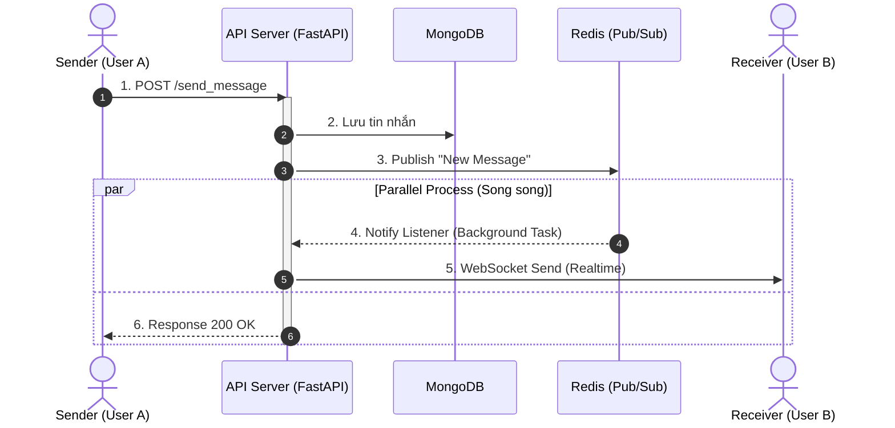
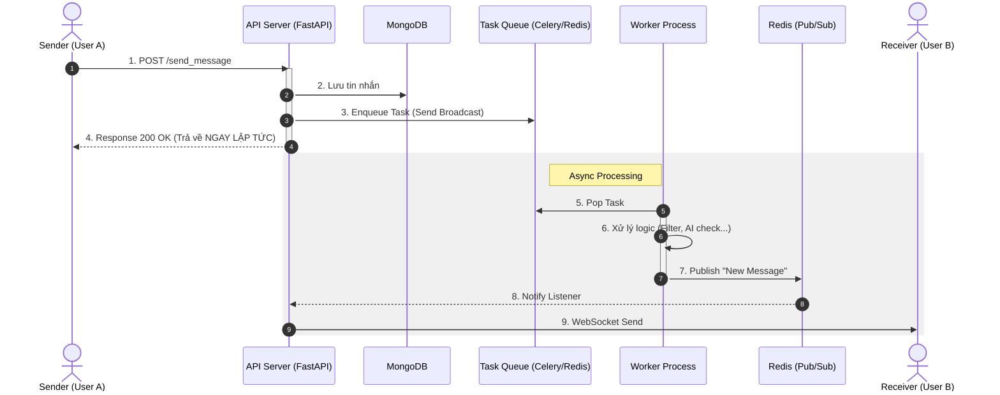

# So Sánh Kiến Trúc Chat System

Tài liệu này so sánh hai mô hình xử lý tin nhắn Real-time bằng biểu đồ Sequence Diagram.

## 1. Luồng Hiện Tại (Phase 1: Redis Pub/Sub)
Đây là cách code hiện tại đang chạy. API Server trực tiếp Publish sự kiện lên Redis.

**Nhận xét:**
*   Bước 3 nằm trong luồng xử lý chính của API.
*   User A phải đợi xong bước 3 mới nhận được phản hồi.

---

## 2. Luồng Mục Tiêu (Phase 2: Async Queue - Recommended)
Đây là mô hình "Response trước, xử lý sau" sử dụng Queue (Celery/RabbitMQ).

**Nhận xét:**
*   API trả về ở Bước 4 (ngay sau khi ném task vào Queue).
*   Toàn bộ việc Publish Redis và gửi Socket diễn ra ngầm ở phía sau (trong hộp màu xám).
*   Nếu Redis bị chậm hoặc chết, User A vẫn thấy tin nhắn đã gửi thành công (vì API đã trả về rồi).
