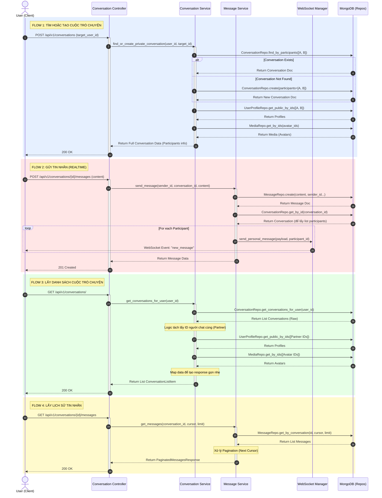

# Tài liệu Luồng Xử lý (Flow) - Chat & Conversations Feature

Tài liệu này mô tả chi tiết luồng dữ liệu của 4 API chính trong tính năng Chat của hệ thống.

## 1. Biểu đồ Sequence (Sequence Diagram)

Bạn có thể copy đoạn code dưới đây vào [Mermaid.live](https://mermaid.live/) để xem biểu đồ trực quan.

## 2. Giải thích chi tiết các API

### 2.1. Tìm hoặc Tạo Cuộc trò chuyện (POST /)
*   **Mục đích**: Đảm bảo rằng luôn có một cuộc hội thoại (Conversation) duy nhất giữa 2 người dùng trước khi bắt đầu chat.
*   **Logic**:
    1.  API nhận `target_user_id`.
    2.  Kiểm tra trong DB xem đã có document nào chứa cả `[current_user_id, target_user_id]` chưa.
    3.  Nếu có -> Trả về luôn.
    4.  Nếu chưa -> Tạo document mới.
    5.  **Quan trọng**: Sau khi có document conversation, hệ thống query tiếp `user_profiles` và `media` để lấy thông tin hiển thị (Tên, Avatar) của cả 2 người tham gia để Frontend hiển thị ngay mà không cần gọi thêm API khác.

### 2.2. Gửi tin nhắn (POST /{id}/messages)
*   **Mục đích**: Lưu tin nhắn và thông báo realtime.
*   **Logic**:
    1.  Lưu tin nhắn vào collection `messages`.
    2.  Query lấy thông tin cuộc hội thoại để biết danh sách người tham gia (`participants`).
    3.  Dùng `WebSocket Manager` để bắn event `new_message` tới **tất cả** người tham gia (bao gồm cả người gửi - để đồng bộ nếu họ đang đăng nhập trên nhiều thiết bị).
    4.  Payload WebSocket chứa đầy đủ thông tin tin nhắn vừa tạo.

### 2.3. Lấy danh sách đoạn chat (GET /)
*   **Mục đích**: Hiển thị danh sách các cuộc hội thoại bên trái màn hình chat.
*   **Logic**:
    1.  Lấy tất cả conversation mà user hiện tại có tham gia.
    2.  **Xử lý Logic**: Với mỗi cuộc hội thoại, hệ thống tự động xác định xem ai là "đối phương" (Partner) bằng cách loại trừ ID của user hiện tại ra.
    3.  Thực hiện **Batch Query** (truy vấn hàng loạt) để lấy Profile và Avatar của tất cả các Partner này cùng lúc (giảm số lần gọi DB).
    4.  Trả về danh sách rút gọn: ID cuộc trò chuyện + Thông tin Partner (Tên, Avatar).

### 2.4. Lấy lịch sử tin nhắn (GET /{id}/messages)
*   **Mục đích**: Load nội dung chat khi user click vào một cuộc hội thoại.
*   **Logic**:
    1.  Query collection `messages` theo `conversation_id`.
    2.  Sử dụng cơ chế **Cursor Pagination** (thay vì Page/Limit truyền thống) để đảm bảo hiệu năng khi dữ liệu lớn và realtime.
    3.  Trả về danh sách tin nhắn kèm `next_cursor` để Frontend load thêm (Infinite Scroll).
