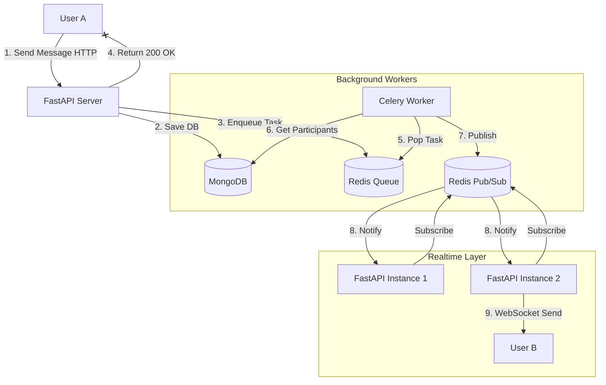

# Kế Hoạch Triển Khai: Chat System Scaling (Queue & Pub/Sub)

Tài liệu này mô tả chi tiết lộ trình nâng cấp hệ thống Chat từ xử lý đồng bộ (Synchronous Loop) sang xử lý bất đồng bộ (Asynchronous Queue) để đảm bảo hiệu năng và khả năng mở rộng trên môi trường Production.

## 1. Phân Tích Hiện Trạng & Vấn Đề
*   **Code hiện tại:** `MessageService` thực hiện vòng lặp `for await` để gửi WebSocket message trực tiếp đến từng user ngay trong request API.
*   **Vấn đề:**
    1.  **Blocking:** API response bị chậm nếu nhóm chat đông thành viên.
    2.  **Scalability:** Không hoạt động nếu triển khai nhiều server (User A ở Server 1 không chat được với User B ở Server 2).
    3.  **Risk:** Lỗi mạng khi gửi socket có thể làm gián đoạn luồng lưu tin nhắn.

---

## 2. Lộ Trình Triển Khai

### Giai Đoạn 1: Tích Hợp Redis Pub/Sub (Giải quyết Scalability)
Mục tiêu: Đảm bảo các server khác nhau có thể "nói chuyện" với nhau. Khi server A nhận tin nhắn, nó báo cho tất cả các server khác biết để đẩy tin xuống cho user.

*   **Bước 1.1: Cấu hình Redis Channel**
    *   Định nghĩa kênh Redis (ví dụ: `chat:broadcast`).
*   **Bước 1.2: Refactor `WebSocketManager`**
    *   Thêm method `subscribe`: Mỗi instance server khi khởi động sẽ subscribe vào kênh `chat:broadcast`.
    *   Xử lý message nhận được từ Redis: Khi có tin mới từ Redis, Manager kiểm tra xem User đích có đang kết nối với server này không. Nếu có -> Gửi tin.
*   **Bước 1.3: Cập nhật `MessageService`**
    *   Thay vì lặp `for`, service chỉ cần `publish` event vào Redis channel.

### Giai Đoạn 2: Xử Lý Bất Đồng Bộ (Background Tasks - Giải quyết Blocking)
Mục tiêu: Trả về phản hồi cho người gửi ngay lập tức (dưới 50ms), việc phân phối tin nhắn thực hiện ngầm.

*   **Bước 2.1: Sử dụng Celery (hoặc Arq/FastAPI BackgroundTasks)**
    *   Cài đặt thư viện Worker (khuyên dùng Celery với Redis Broker cho Production lớn, hoặc Arq cho nhẹ nhàng hơn).
*   **Bước 2.2: Tạo Worker Task**
    *   Tạo function `task_broadcast_message(conversation_id, message_data)`.
    *   Logic trong task:
        1. Lấy danh sách participants từ DB.
        2. Publish message vào Redis Pub/Sub (đã làm ở Giai đoạn 1).
        3. (Mở rộng) Gửi Push Notification (FCM/OneSignal) cho user đang offline.
*   **Bước 2.3: Cập nhật API Endpoint**
    *   Khi gọi `send_message`, chỉ lưu vào DB -> Đẩy task vào Queue -> Return ngay lập tức.

### Giai Đoạn 3: Tối Ưu & Monitoring (Production Ready)
*   **Bước 3.1: Connection Management**
    *   Lưu trạng thái Online/Offline của user vào Redis (Redis Set hoặc Hash) thay vì chỉ lưu trong RAM.
*   **Bước 3.2: Error Handling & Retry**
    *   Cấu hình Retry cho Celery task nếu Redis bị time-out.
    *   Dead Letter Queue cho các tin nhắn không thể gửi được.

---

## 3. Kiến Trúc Đích (Target Architecture)

## 4. Các File Cần Chỉnh Sửa Chính
1.  `app/core/redis_client.py`: Cấu hình thêm Pub/Sub client.
2.  `app/core/websocket.py`: Logic Subscribe Redis và broadcast message.
3.  `app/services/message_service.py`: Loại bỏ vòng lặp `for`, thay bằng đẩy task/publish redis.
4.  (Mới) `app/worker.py`: Nơi chứa logic Celery/Background Task.
