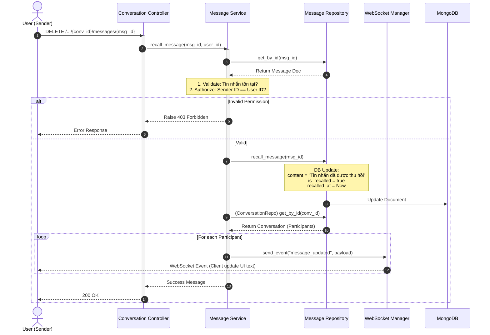

# Kế hoạch Triển khai Tính năng Thu hồi Tin nhắn (Recall Message)

Tài liệu này mô tả chi tiết các bước triển khai tính năng thu hồi tin nhắn trong hệ thống chat. Thay vì xóa hoàn toàn khỏi DB, nội dung tin nhắn sẽ được ghi đè và đánh dấu trạng thái thu hồi.

## 1. Luồng xử lý (Sequence Diagram)



## 2. Chi tiết Code Implementation

### Bước 1: Cập nhật Repository
**File:** `app/repositories/message_repository.py`

```python
    # Tìm tin nhắn theo ID
    async def get_by_id(self, message_id: str) -> Optional[Dict[str, Any]]:
        return await self.collection.find_one({"_id": ObjectId(message_id)})

    # Ghi đè nội dung và đánh dấu thu hồi
    async def recall_message(self, message_id: str) -> bool:
        result = await self.collection.update_one(
            {"_id": ObjectId(message_id)},
            {
                "$set": {
                    "content": "Tin nhắn đã được thu hồi",
                    "is_recalled": True,
                    "recalled_at": datetime.utcnow()
                }
            }
        )
        return result.modified_count > 0

    # Cập nhật hàm create để có mặc định
    async def create(self, conversation_id: str, sender_id: str, content: str) -> Dict[str, Any]:
        doc = {
            "conversation_id": ObjectId(conversation_id),
            "sender_id": ObjectId(sender_id),
            "content": content,
            "created_at": datetime.utcnow(),
            "is_recalled": False,
            "recalled_at": None
        }
        # ... insert logic ...
```

### Bước 2: Cập nhật Service
**File:** `app/services/message_service.py`

```python
    async def recall_message(self, message_id: str, user_id: str):
        # 1. Kiểm tra tồn tại
        message = await self.message_repo.get_by_id(message_id)
        if not message:
            raise HTTPException(status_code=404, detail="Tin nhắn không tồn tại")

        # 2. Kiểm tra quyền (chỉ người gửi được thu hồi)
        if str(message["sender_id"]) != user_id:
            raise HTTPException(status_code=403, detail="Không có quyền thu hồi")
        
        # 3. Thực hiện ghi đè trong DB
        await self.message_repo.recall_message(message_id)

        # 4. Bắn sự kiện Realtime cho mọi người trong nhóm
        conversation_id = str(message["conversation_id"])
        conversation = await self.conversation_repo.get_by_id(conversation_id)

        payload = {
            "type": "message_updated",
            "conversation_id": conversation_id,
            "data": {
                "id": message_id,
                "content": "Tin nhắn đã được thu hồi",
                "is_recalled": True,
                "recalled_at": datetime.utcnow().isoformat()
            }
        }

        if conversation:
            for p in conversation["participants"]:
                await manager.send_personal_message(payload, str(p["user_id"]))

        return {"message": "Thu hồi thành công"}
```

### Bước 3: Cập nhật Endpoint
**File:** `app/api/v1/endpoints/conversations.py`

```python
@router.delete("/{conversation_id}/messages/{message_id}", summary="Thu hồi tin nhắn")
async def recall_message(
    conversation_id: str,
    message_id: str,
    current_user: dict = Depends(get_current_user),
    message_service: MessageService = Depends(get_message_service)
):
    return await message_service.recall_message(
        message_id=message_id,
        user_id=str(current_user["_id"])
    )
```
