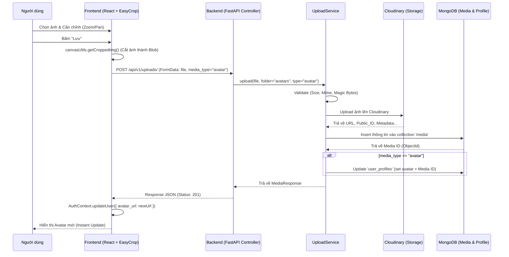

# Tài liệu Luồng Xử lý Upload Media (Avatar)

Tài liệu này mô tả chi tiết cách hệ thống xử lý việc upload và cập nhật ảnh đại diện từ Frontend đến Backend.

## 1. Sơ đồ trình tự (Sequence Diagram)

## 2. Chi tiết thực hiện

### A. Frontend (Client-side)
* **Thư viện sử dụng:** `react-easy-crop` (Xử lý UI cắt ảnh), `axios` (Gửi request).
* **Quy trình xử lý:**
    1. **Pre-processing:** Khi người dùng chọn ảnh, hệ thống hiển thị modal với giao diện Crop hình tròn. Người dùng có thể Zoom (bằng slider hoặc nút +/-) và di chuyển ảnh.
    2. **Image Processing:** Sử dụng Canvas API (`src/utils/canvasUtils.ts`) để trích xuất vùng ảnh đã chọn. Kết quả là một `Blob` (Binary Large Object) định dạng JPEG.
    3. **Service Layer:** `MediaService` đóng gói Blob vào `FormData` và gửi lên backend kèm theo header xác thực JWT.
    4. **State Management:** Sau khi thành công, `AuthContext` cập nhật lại state của `user` trong bộ nhớ, giúp mọi nơi sử dụng avatar (Header, Sidebar, Profile) thay đổi ngay lập tức.

### B. Backend (Server-side)
* **Controller:** `uploads.py` nhận dữ liệu thô từ request.
* **Service:** `UploadService` đóng vai trò trung tâm xử lý logic.
    * **Bảo mật:** Kiểm tra **Magic Bytes** (chữ ký số của file) để đảm bảo file gửi lên thực sự là ảnh, tránh các cuộc tấn công upload shell.
    * **Xử lý bất đồng bộ:** Sử dụng `run_in_threadpool` khi gọi Cloudinary SDK để không làm block Event Loop của FastAPI.
* **Database Design:**
    * **Normalized Pattern:** Thông tin Media được lưu riêng tại bảng `media`.
    * **Reference:** Bảng `user_profiles` chỉ lưu `ObjectId` của ảnh. Điều này giúp quản lý tài nguyên media tập trung và dễ dàng tái sử dụng (ví dụ: một ảnh có thể vừa là avatar vừa là bài viết).

### C. Cơ chế Hiển thị (Population)
Khi người dùng truy cập hoặc reload trang, hàm `get_current_user` trong `dependencies.py` sẽ:
1. Lấy thông tin từ `user_profiles`.
2. Kiểm tra nếu có `avatar` ID, thực hiện lookup sang bảng `media`.
3. Thay thế ID bằng **URL** thực tế trước khi trả về cho Frontend.

---
*Ngày cập nhật: 13/01/2026*
*Tác giả: Gemini CLI Assistant*
