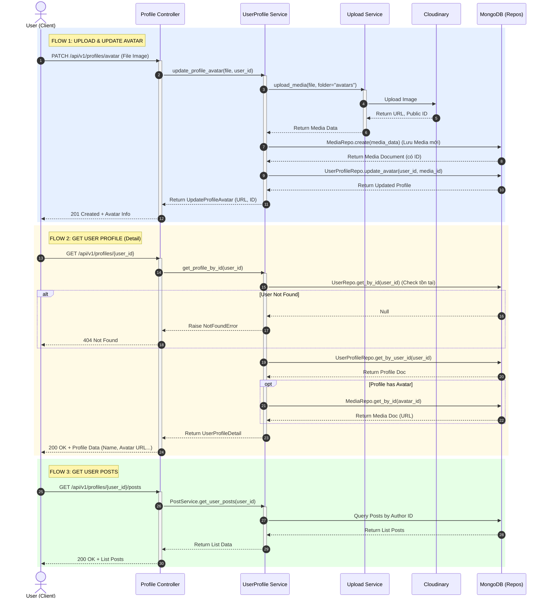

# Tài liệu Luồng Xử lý (Flow) - Profile Feature

Tài liệu này mô tả chi tiết luồng dữ liệu của các API liên quan đến Profile trong hệ thống.

## 1. Biểu đồ Sequence (Sequence Diagram)

Bạn có thể copy đoạn code dưới đây vào [Mermaid.live](https://mermaid.live/) để xem biểu đồ.

## 2. Giải thích chi tiết các bước

### 2.1. Upload & Cập nhật Avatar (PATCH /avatar)
*   **Input**: File hình ảnh (multipart/form-data) và Access Token.
*   **Logic**:
    1.  Backend nhận file, chuyển cho `UploadService` để đẩy lên Cloudinary trong folder `avatars`.
    2.  Sau khi có URL từ Cloudinary, thông tin được lưu vào collection `media`.
    3.  Lấy ID của media mới tạo, cập nhật vào field `avatar` của User tương ứng trong collection `user_profiles`.
*   **Output**: Trả về thông tin media (ID, URL, Type) để Frontend cập nhật UI ngay lập tức.

### 2.2. Lấy thông tin Profile (GET /{user_id})
*   **Logic**:
    1.  Kiểm tra user có tồn tại trong hệ thống không qua `UserRepo`.
    2.  Truy vấn thông tin cơ bản (display_name, ...) từ `UserProfileRepo`.
    3.  Nếu có `avatar_id`, tiếp tục truy vấn sang `MediaRepo` để lấy URL ảnh thật.
*   **Output**: Profile hoàn chỉnh bao gồm thông tin hiển thị và ảnh đại diện.

### 2.3. Lấy danh sách bài viết (GET /{user_id}/posts)
*   **Logic**:
    1.  Sử dụng `PostService` để lọc tất cả bài viết có `author_id` khớp với `user_id`.
    2.  Hỗ trợ phân trang (cursor/limit) để tối ưu hiệu năng.
